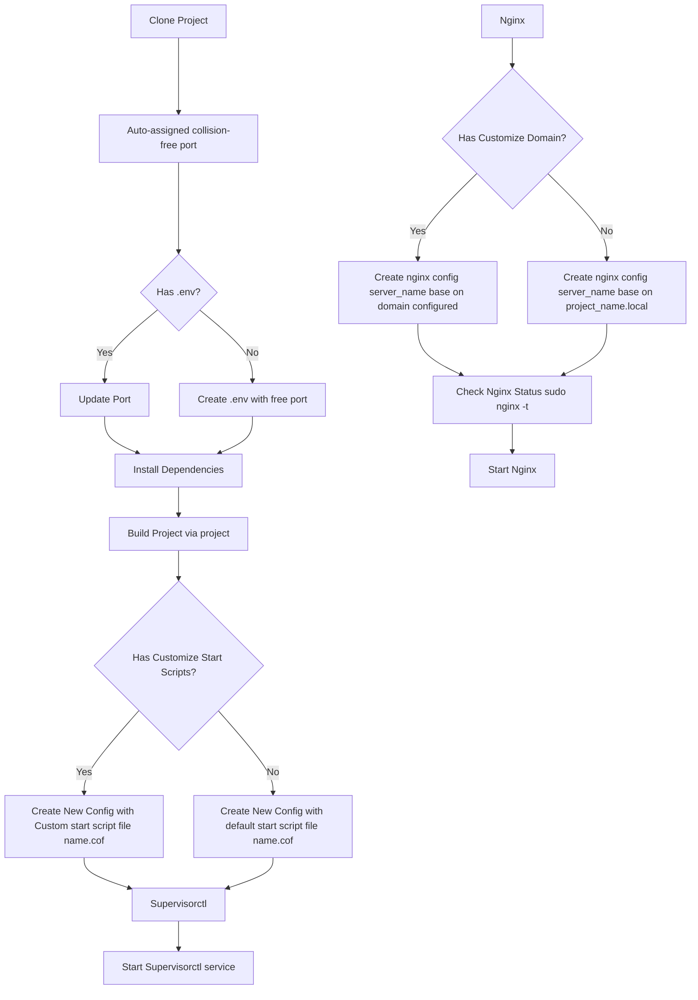

```mermaid
flowchart TD
    A[Clone Project] --> B[Auto-assigned collision-free port]
    B --> C{Has .env?}
    C -->|Yes| D[Update Port]
    C -->|No| E[Create .env with free port]
    D --> F[Install Dependencies]
    E --> F
    F --> G[Build Project via project]

    G --> H{Has Customize Start Scripts?}
    H -->|Yes| I[Create New Config with Custom start script file name.cof]
    H -->|No| J[Create New Config with default start script file name.cof]
    I --> K[Supervisorctl]
    J --> K
    K --> L[Start Supervisorctl service]

    M[Nginx] --> N{Has Customize Domain?}
    N -->|Yes| O[Create nginx config server_name base on domain configured]
    N -->|No| P[Create nginx config server_name base on project_name.local]
    O --> Q[Check Nginx Status sudo nginx -t]
    P --> Q
    Q --> R[Start Nginx]
```